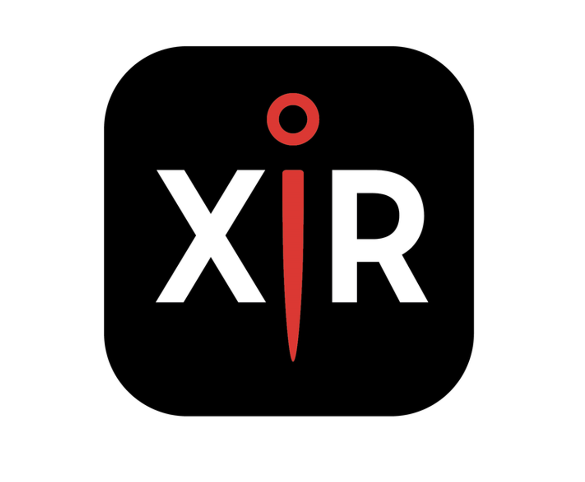
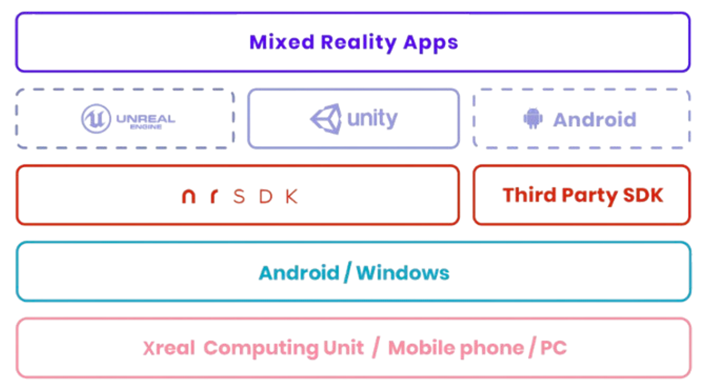

# XR Pin, AR을 활용한 효율적인 인수인계 시스템

## 프로젝트 소개

  

프로젝트 설명

## 주요기능

1. Pinch Detection
* Pinch Detection 설명

2. Write And Record
* Write And Record 기능 설명

3. Check completed task
* Check Completed task 설명

## 서비스 아키텍처
 

💁‍♂️ 아키텍처 설명

## 핵심 사용 기술
### hand landmark
hand landmark 설명

### 좌표 처리
좌표처리 설명
